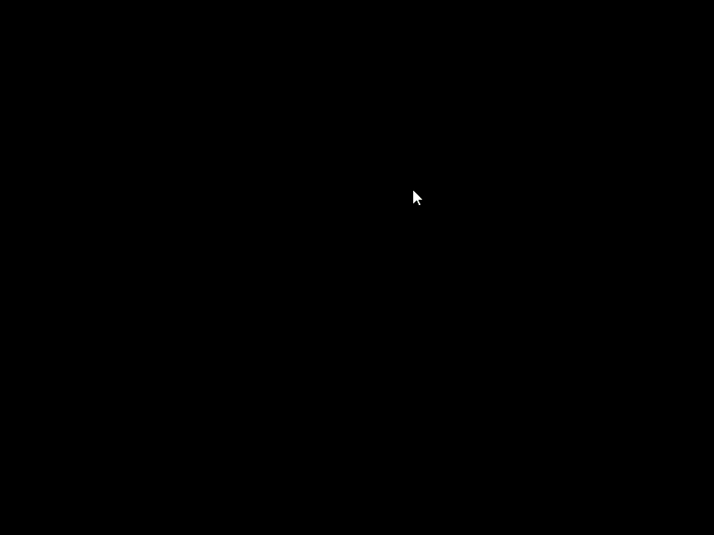

# Fireworks
This is a physics simulation for fireworks! The idea was to simulate a firework trajectory and it's particles dissipation based on an explosion force.

<h2> Goals </h2>

	<b> To simulate a firework trajectory, it's trail and it's explosion based on an explosion force and dissipassion formula, simulating the light from it's particles too. </b>

<h2> Achieved </h2>

  All of the goals were achieved.

